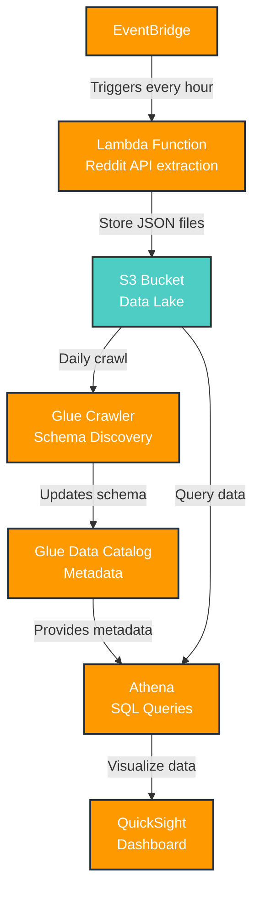

# AWS Reddit Streaming Pipeline

This project captures and tracks trending Reddit content by streaming hourly snapshots from Reddit's API into an AWS S3 bucket. The goal is to showcase real-time analytics using serverless tools while staying fully within AWS Free Tier limits.

## AWS Components

- **AWS Lambda**: Serverless function for Reddit API data ingestion
- **Amazon EventBridge**: Automated hourly trigger scheduling
- **Amazon S3**: Data lake with date-partitioned storage
- **AWS Glue**: Schema discovery and data catalog management
- **Amazon Athena**: SQL query engine
- **Amazon QuickSight**: Visualization dashboard

## Architecture & Data Flow



## Sample Data

The pipeline collects Reddit posts in JSON Lines format. Here's a sample of the data structure:

```json
{
  "id": "1ls47pd",
  "title": "An anonymous person who made a $7,800 investment in bitcoin in 2011 has just touched their wallet for the first time in 14 years… He's now worth $1.1 BILLION.",
  "author": "TheGhost5322",
  "subreddit": "interestingasfck",
  "score": 17925,
  "num_comments": 704,
  "url": "https://i.redd.it/sln00o7lc0bf1.jpeg",
  "permalink": "/r/interestingasfck/comments/1ls47pd/an_anonymous_person_who_made_a_7800_investment_in/",
  "selftext": "",
  "created_utc": "2025-07-05T07:26:23",
  "fetched_utc": "2025-07-05T11:04:37.570322",
  "over_18": false,
  "is_video": false,
  "post_hint": "image",
  "thumbnail": "https://b.thumbs.redditmedia.com/CfDjmig3_zdMpyNm8lk1YZMYF-ctB4cn6FSq8_h_7ac.jpg",
  "link_flair_text": " /r/all, /r/popular",
  "domain": "i.redd.it"
}
```

### Data Fields

| Field | Type | Description |
|-------|------|-------------|
| `id` | string | Reddit post ID |
| `title` | string | Post title (emoji-free) |
| `author` | string | Username of post author |
| `subreddit` | string | Subreddit name |
| `score` | integer | Post upvotes minus downvotes |
| `num_comments` | integer | Number of comments |
| `url` | string | Post URL |
| `permalink` | string | Reddit permalink |
| `selftext` | string | Post text content |
| `created_utc` | string | Post creation timestamp (ISO) |
| `fetched_utc` | string | Data collection timestamp (ISO) |
| `over_18` | boolean | NSFW flag |
| `is_video` | boolean | Video post flag |
| `post_hint` | string | Post type hint |
| `thumbnail` | string | Thumbnail URL |
| `link_flair_text` | string | Post flair text |
| `domain` | string | Source domain |

## Sample Dashboard

