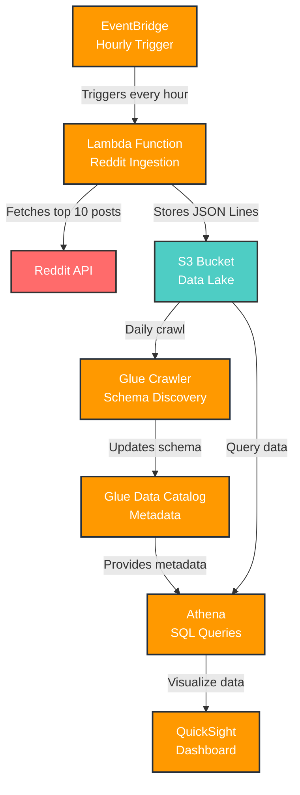

# 🛰️ AWS Reddit Streaming Pipeline

A serverless, cost-effective data pipeline to stream Reddit data using AWS services.

## Tech Stack

- **AWS Lambda** – Reddit ingestion using PRAW
- **Amazon EventBridge** – Hourly trigger scheduling
- **Amazon S3** – Raw JSON Lines data storage
- **AWS Glue** – Schema discovery using Crawler
- **Amazon Athena** – Query raw data using SQL
- **Amazon QuickSight** – Visualize trending posts

## Architecture



## Data Flow

1. **EventBridge** triggers Lambda every hour
2. **Lambda** fetches top 10 hot Reddit posts via PRAW
3. **S3** stores data in JSON Lines format (`raw/YYYY-MM-DD/reddit_data_HH_MM_SS.json`)
4. **Glue Crawler** scans data daily and updates schema
5. **Athena** queries the cataloged data using SQL
6. **QuickSight** visualizes trends and insights

## 📊 Sample Data

The pipeline collects Reddit posts in JSON Lines format. Here's a sample of the data structure:

```json
{
  "id": "1ls47pd",
  "title": "An anonymous person who made a $7,800 investment in bitcoin in 2011 has just touched their wallet for the first time in 14 years… He's now worth $1.1 BILLION.",
  "author": "TheGhost5322",
  "subreddit": "interestingasfck",
  "score": 17925,
  "num_comments": 704,
  "url": "https://i.redd.it/sln00o7lc0bf1.jpeg",
  "permalink": "/r/interestingasfck/comments/1ls47pd/an_anonymous_person_who_made_a_7800_investment_in/",
  "selftext": "",
  "created_utc": "2025-07-05T07:26:23",
  "fetched_utc": "2025-07-05T11:04:37.570322",
  "over_18": false,
  "is_video": false,
  "post_hint": "image",
  "thumbnail": "https://b.thumbs.redditmedia.com/CfDjmig3_zdMpyNm8lk1YZMYF-ctB4cn6FSq8_h_7ac.jpg",
  "link_flair_text": " /r/all, /r/popular",
  "domain": "i.redd.it"
}
```

### Data Fields

| Field | Type | Description |
|-------|------|-------------|
| `id` | string | Reddit post ID |
| `title` | string | Post title (emoji-free) |
| `author` | string | Username of post author |
| `subreddit` | string | Subreddit name |
| `score` | integer | Post upvotes minus downvotes |
| `num_comments` | integer | Number of comments |
| `url` | string | Post URL |
| `permalink` | string | Reddit permalink |
| `selftext` | string | Post text content |
| `created_utc` | string | Post creation timestamp (ISO) |
| `fetched_utc` | string | Data collection timestamp (ISO) |
| `over_18` | boolean | NSFW flag |
| `is_video` | boolean | Video post flag |
| `post_hint` | string | Post type hint |
| `thumbnail` | string | Thumbnail URL |
| `link_flair_text` | string | Post flair text |
| `domain` | string | Source domain |

## Sample Dashboard


## 📂 Folder Structure

| Folder        | Description                      |
|---------------|----------------------------------|
| `lambda/`     | Reddit ingestion function        |
| `athena/`     | Example SQL queries              |
| `quicksight/` | Dashboard screenshots            |
| `glue/`       | Crawler setup notes              |
| `architecture/` | Architecture diagram (optional)|

## Features

### Hourly Reddit Data Pipeline
- **Automated Collection**: Lambda function triggers every hour via EventBridge
- **Real-time Data**: Captures current "hot" posts from Reddit
- **Scalable Architecture**: Serverless design handles varying Reddit API response times
- **Data Freshness**: Ensures up-to-date trending content for analysis
- **Fault Tolerance**: Built-in error handling and retry mechanisms
- **Monitoring**: CloudWatch logs track pipeline health and performance

### Data Processing
- **JSON Lines Format**: Optimized for AWS Glue schema discovery
- **Data Cleaning**: Automatic emoji removal and text sanitization
- **Structured Storage**: Date-partitioned S3 storage for efficient querying
- **Metadata Enrichment**: Adds collection timestamps and processing flags

### Cost Optimization
- **Free Tier Compatible**: Designed to fit within AWS free tier limits
- **Serverless Pricing**: Pay only for actual compute time and storage used
- **Efficient Queries**: Athena queries optimized for cost-effective data analysis
- **Lifecycle Management**: S3 lifecycle policies for long-term cost control

## Setup Steps

1. Deploy Lambda with env vars:
   - `REDDIT_CLIENT_ID`, `REDDIT_SECRET`, etc.
2. Point to S3 path: `s3://your-bucket/raw/YYYY-MM-DD/`
3. Configure Glue Crawler (no classifier, JSON format).
4. Run Athena queries (see `athena/` folder).
5. Build QuickSight dashboard.