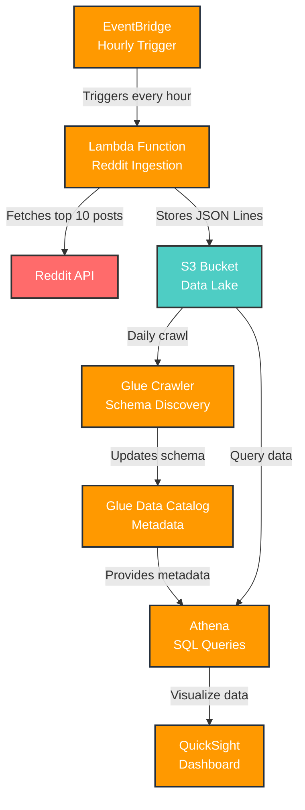
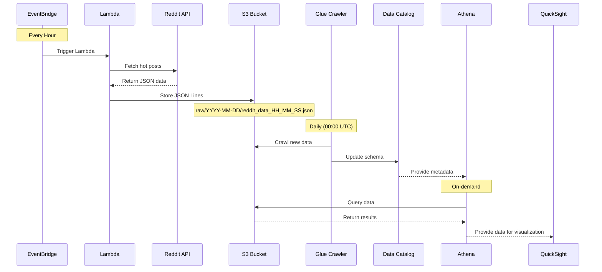

# AWS Reddit Streaming Pipeline Architecture

## System Architecture Diagram

## Data Flow Diagram

## Component Details

### 1. EventBridge
- **Purpose**: Triggers Lambda function every hour
- **Schedule**: `rate(1 hour)`
- **Cost**: Free tier eligible

### 2. Lambda Function
- **Runtime**: Python 3.9+
- **Memory**: 128 MB (sufficient for API calls)
- **Timeout**: 30 seconds
- **Dependencies**: `boto3`, `praw`

### 3. S3 Bucket
- **Structure**: `s3://bucket/raw/YYYY-MM-DD/`
- **Format**: JSON Lines (one object per line)
- **Partitioning**: Date-based for efficient querying

### 4. Glue Crawler
- **Frequency**: Daily at 00:00 UTC
- **Output**: Updates Data Catalog table
- **Schema**: Auto-discovered from JSON structure

### 5. Athena
- **Engine**: Presto (serverless)
- **Storage**: Pay per query
- **Format**: JSON with Glue catalog

### 6. QuickSight
- **Data Source**: Athena
- **Refresh**: Hourly (manual or scheduled)
- **Visualizations**: Time series, bar charts, tables 